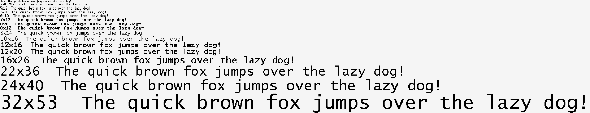

# pntr_pixelfont

Additional small pixel fonts from [uGUI](https://github.com/achimdoebler/UGUI) for use in [pntr](https://github.com/RobLoach/pntr).

## API

``` c
pntr_font* pntr_load_pixelfont(pntr_pixelfont font);
pntr_vector pntr_pixelfont_size(pntr_pixelfont font);
```

## Fonts

The following pixel fonts are available:

- `PNTR_PIXELFONT_4X6`
- `PNTR_PIXELFONT_5X8`
- `PNTR_PIXELFONT_5X12`
- `PNTR_PIXELFONT_6X8`
- `PNTR_PIXELFONT_6X10`
- `PNTR_PIXELFONT_7X12`
- `PNTR_PIXELFONT_8X8`
- `PNTR_PIXELFONT_8X12`
- `PNTR_PIXELFONT_8X14`
- `PNTR_PIXELFONT_10X16`
- `PNTR_PIXELFONT_12X16`
- `PNTR_PIXELFONT_12X20`
- `PNTR_PIXELFONT_16X26`
- `PNTR_PIXELFONT_22X36`
- `PNTR_PIXELFONT_24X40`
- `PNTR_PIXELFONT_32X53`



## Usage

``` c
#define PNTR_PIXELFONT_IMPLEMENTATION
#define PNTR_PIXELFONT_ENABLE_ALL
// #define PNTR_PIXELFONT_ENABLE_4X6
// #define PNTR_PIXELFONT_ENABLE_5X8
// #define PNTR_PIXELFONT_ENABLE_5X12
// #define PNTR_PIXELFONT_ENABLE_6X8
// #define PNTR_PIXELFONT_ENABLE_6X10
// #define PNTR_PIXELFONT_ENABLE_7X12
// #define PNTR_PIXELFONT_ENABLE_8X8
// #define PNTR_PIXELFONT_ENABLE_8X12
// #define PNTR_PIXELFONT_ENABLE_8X14
// #define PNTR_PIXELFONT_ENABLE_10X16
// #define PNTR_PIXELFONT_ENABLE_12X16
// #define PNTR_PIXELFONT_ENABLE_12X20
// #define PNTR_PIXELFONT_ENABLE_16X26
// #define PNTR_PIXELFONT_ENABLE_22X36
// #define PNTR_PIXELFONT_ENABLE_24X40
// #define PNTR_PIXELFONT_ENABLE_32X53
#include "pntr_pixelfont.h"

int main() {
    // Load one of the pixel fonts.
    pntr_font* font = pntr_load_pixelfont(PNTR_PIXELFONT_8X12);

    // Generate an image with the text in it.
    pntr_image* image = pntr_gen_image_text(font, "Hello, World!", PNTR_BLACK, PNTR_RAYWHITE);

    // Save the image locally.
    pntr_save_image(image, "pntr_pixelfont_8x12.png");

    // Unload the font and image.
    pntr_unload_image(image);
    pntr_unload_font(font);

    return 0;
}
```

## Customization

You can change pntr's default font by defining the callback.

```c
#define PNTR_PIXELFONT_DEFAULT PNTR_PIXELFONT_8X8
#define PNTR_DEFAULT_FONT pntr_load_pixelfont_default
```

## License

Unless stated otherwise, all works are:

- Copyright (c) 2023 [Rob Loach](https://robloach.net)

... and licensed under:

- [zlib License](LICENSE)
