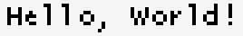
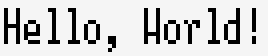
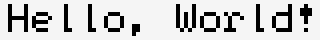
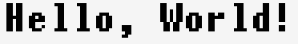
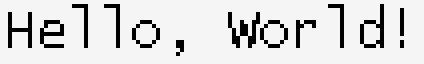

# pntr_pixelfont

Additional small pixel fonts from [uGUI](https://github.com/achimdoebler/UGUI) for use in [pntr](https://github.com/RobLoach/pntr).

## API

``` c
pntr_font* pntr_load_pixelfont(pntr_pixelfont font);
pntr_vector pntr_pixelfont_size(pntr_pixelfont font);
```

## Fonts

The following pixel font sizes are available: 4x6, 5x8, 5x12, 6x8, 6x10, 7x12, 8x8, 8x12.

### `PNTR_PIXELFONT_4X6`


### `PNTR_PIXELFONT_5X8`



### `PNTR_PIXELFONT_5X12`



### `PNTR_PIXELFONT_6X8`



### `PNTR_PIXELFONT_6X10`


### `PNTR_PIXELFONT_7X12`



### `PNTR_PIXELFONT_8X8`


### `PNTR_PIXELFONT_8X12`


### `PNTR_PIXELFONT_8X14`



## Usage

``` c
#define PNTR_PIXELFONT_FONT_IMPLEMENTATION
#define PNTR_PIXELFONT_ENABLE_ALL
// #define PNTR_PIXELFONT_ENABLE_4X6
// #define PNTR_PIXELFONT_ENABLE_5X8
// #define PNTR_PIXELFONT_ENABLE_5X12
// #define PNTR_PIXELFONT_ENABLE_6X8
// #define PNTR_PIXELFONT_ENABLE_6X10
// #define PNTR_PIXELFONT_ENABLE_7X12
// #define PNTR_PIXELFONT_ENABLE_8X8
// #define PNTR_PIXELFONT_ENABLE_8X12
// #define PNTR_PIXELFONT_ENABLE_8X14
#include "pntr_pixelfont.h"

int main() {
    // Load one of the pixel fonts.
    pntr_font* font = pntr_load_pixelfont(PNTR_PIXELFONT_8X12);

    // Generate an image with the text in it.
    pntr_image* image = pntr_gen_image_text(font, "Hello, World!", PNTR_BLACK, PNTR_RAYWHITE);

    // Save the image locally.
    pntr_save_image(image, "pntr_pixelfont_8x12.png");

    // Unload the font and image.
    pntr_unload_image(image);
    pntr_unload_font(font);

    return 0;
}
```

## License

Unless stated otherwise, all works are:

- Copyright (c) 2023 [Rob Loach](https://robloach.net)

... and licensed under:

- [zlib License](LICENSE)
